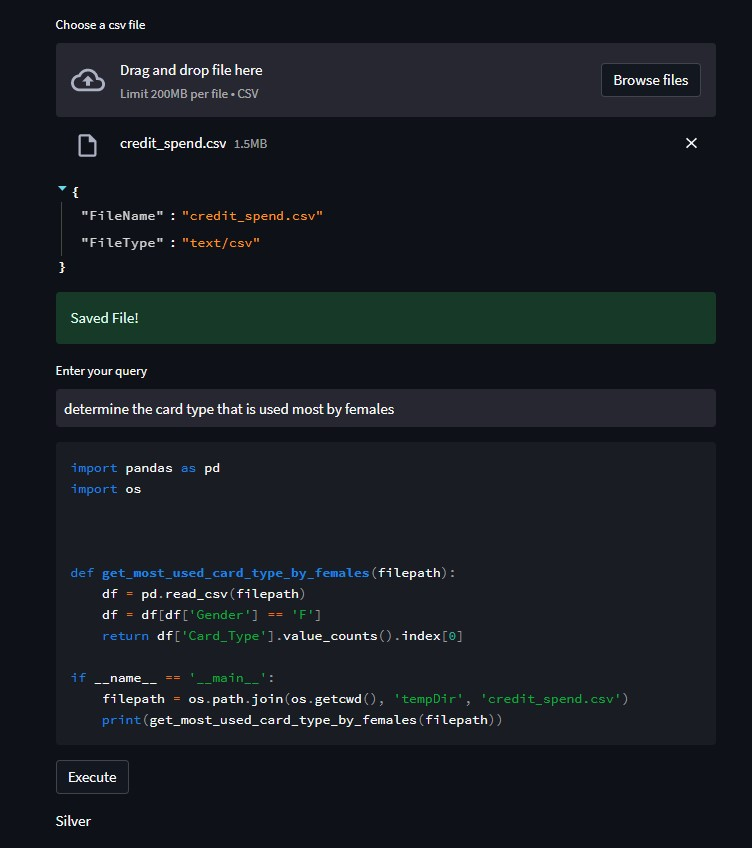

<!DOCTYPE html>
<html>
  <head>
    <meta charset="UTF-8">
  </head>
  <body>
    <h1>DAcodex</h1>
    
DAcodex is a tool to generate and execute code for data analysis using natural language queries. The code generation is powered by OpenAI's <a href=https://platform.openai.com/docs/guides/code>Codex model series</a>.

Click this <a href='https://dacodex.streamlit.app/'>link</a> to try out the app

 <h2>Requirements</h2>
<ul>
  <li>Python 3</li>
  <li>OpenAI API Key</li>
  <li>pandas</li>
  <li>streamlit</li>
  <li>openai</li>
</ul>

<h2>Usage</h2>
<ol>
  <li>Install the required packages by running <code>pip install -r requirements.txt</code> in your terminal/command prompt.</li>
  <li>Set the OpenAI API key in the environment variables with the name OPENAI_API_KEY.</li>
  <li>Run the app using <code>streamlit run .\DAcodex.py</code> in your terminal/command prompt.</li>
  <li>In the app, upload a csv file using the file uploader.</li>
  <li>Enter a natural language query in the input field and click "Submit".</li>
  <li>The code generated by OpenAI's GPT3 will be displayed in the output section.</li>
  <li>The code can be saved to a python file by clicking the "Save Code" button.</li>
</ol>

<h2>Code</h2>

The code has been structured in a modular way and can be easily understood and customized. The key functions include:

<ul>
  <li><code>csv_data_extractor</code>: extracts the column names and a sample data row from the uploaded csv file.</li>
  <li><code>fixed_prompt_portion</code>: generates a portion of the prompt to be passed to OpenAI's GPT3.</li>
  <li><code>prompt_generator</code>: generates the complete prompt to be passed to OpenAI's GPT3.</li>
  <li><code>get_model_response</code>: calls the OpenAI API to generate code for the given prompt.</li>
  <li><code>code_parser_input</code>: processes the generated code and formats it for saving to a file.</li>
  <li><code>parse_response</code>: extracts the import statements and the code (excluding imports) from the response received from OpenAI.</li>
  <li><code>save_code_to_file</code>: saves the generated code to a python file.</li>
</ul>

The app has been built using streamlit.

  </body>
</html>
